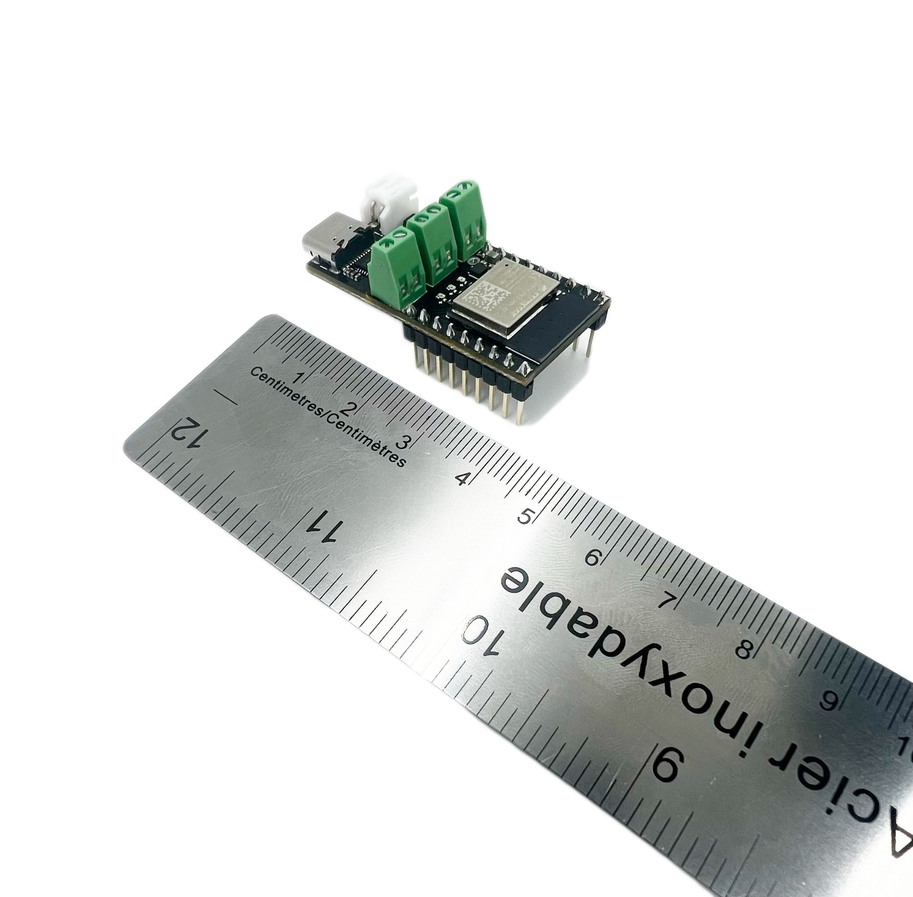

# Page 1

## Text Content

```
titanhaptics.com

TITAN Core

Quick Start Guide
Overview
A fully contained Haptics Evaluation Board with a 32-bit ESP32 Processor, Wi-Fi,
Bluetooth, Haptics, DAC, DSP, and in a tiny, low-cost footprint.
TITAN Core is perfect for prototyping haptics, and can also be used for testing
motors, effects, games and other haptic applications.

PRIVATE AND CONFIDENTIAL. Property of TITAN HAPTICS INC. All Rights Reserved. www.titanhaptics.com

1 / 13


```

## Images





