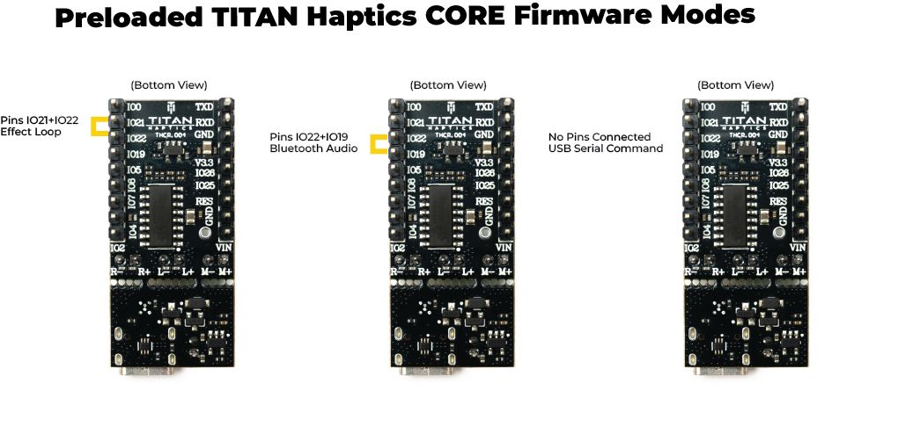
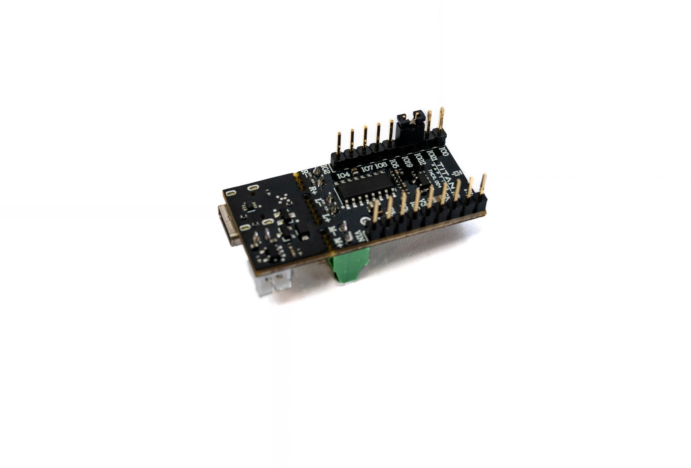
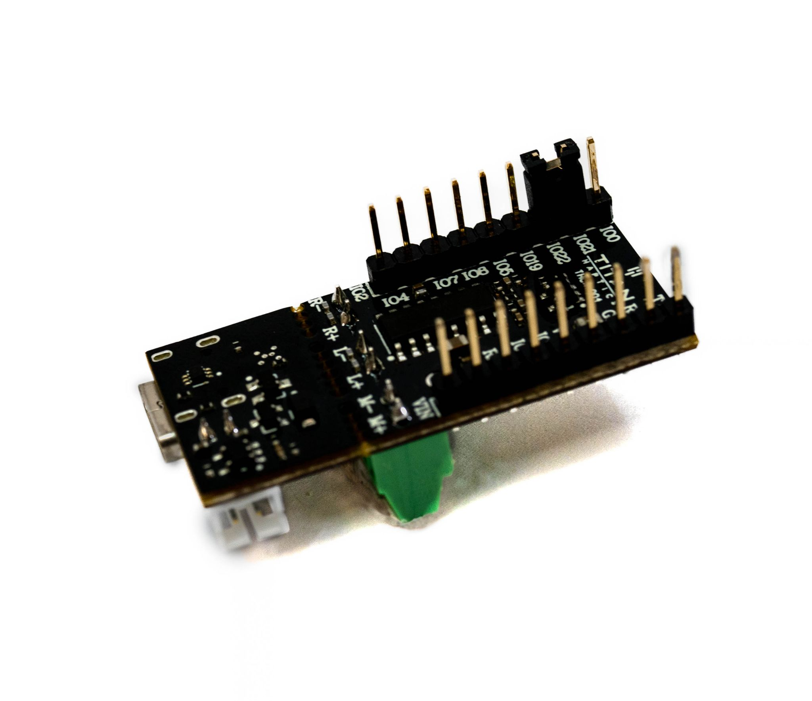

# Page 10

## Text Content

```
titanhaptics.com

2.

Bluetooth Mode
To activate “Bluetooth” mode, jump IO19 and IO22 using the pin jumper provided or
jumper wires.

Once the pin jumper has been attached, your TITAN Core will be discoverable
(VHDevice*number*) and you can now connect to it via bluetooth. Your TITAN Core
will be capable of receiving bluetooth signals from your device and you can test this
out by playing audio on YouTube/Spotify. Only the L and R channels are used in this
mode.
3.

Effect Loop
To activate “Effect Loop” mode, jump IO21 and IO22 using the pin jumper
provided.

This mode plays different effects in a loop. Once the pin jumper has been attached, the
haptic effects in the loop will be played automatically. To view the name of each effect,
connect your TITAN CORE to a computer using a USB-C cable and open the serial monitor
with a baud rate of 115200. In this mode, all three channels are used.

PRIVATE AND CONFIDENTIAL. Property of TITAN HAPTICS INC. All Rights Reserved. www.titanhaptics.com

10 / 13


```

## Images









