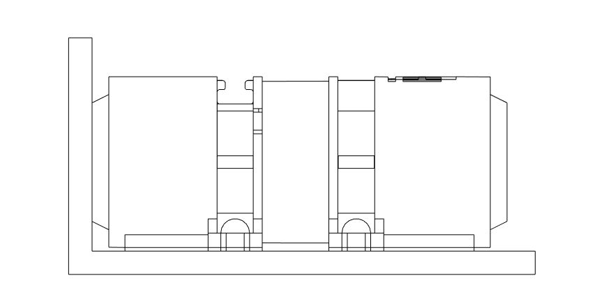
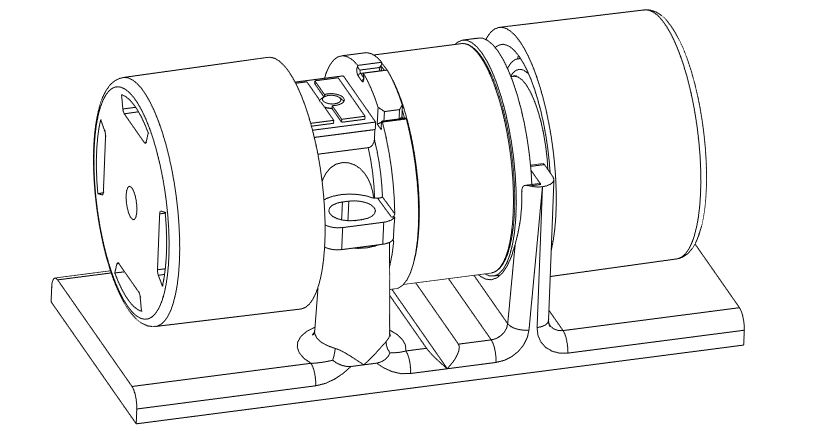

# Page 12

## Text Content

```
titanhaptics.com

Haptic Integration
1.

Vector Haptics Firmware (Arduino)

To fully customize haptic effects using TITAN CORE, you can design your own Arduino code
based on TITAN’s Vector Haptics library.

2.

Mounting Guide

How to mount TacHammer motor
TacHammer motors vibrate linearly along the longitudinal direction, in which the haptic
feedback is the most perceivable. It’s recommended to align the motor’s longitudinal axis
perpendicular to the haptic contact surface of the device and use the built-in adhesive to
secure the motor to a flat, oil-free surface.
DRAKE TacHammer - Remove the adhesive strips on the back of the DRAKE motors and
adhere it to a surface.
Carlton TacHammer - Use screws to attach the motor to a surface or place the motor in a
mount. To download the mount STL file, visit this web page and for more information, see
TacHammer Development Kit Guide.

Carlton TacHammer
on mount

Adhesive strips on
DRAKE motor

PRIVATE AND CONFIDENTIAL. Property of TITAN HAPTICS INC. All Rights Reserved. www.titanhaptics.com

12 / 13


```

## Images






