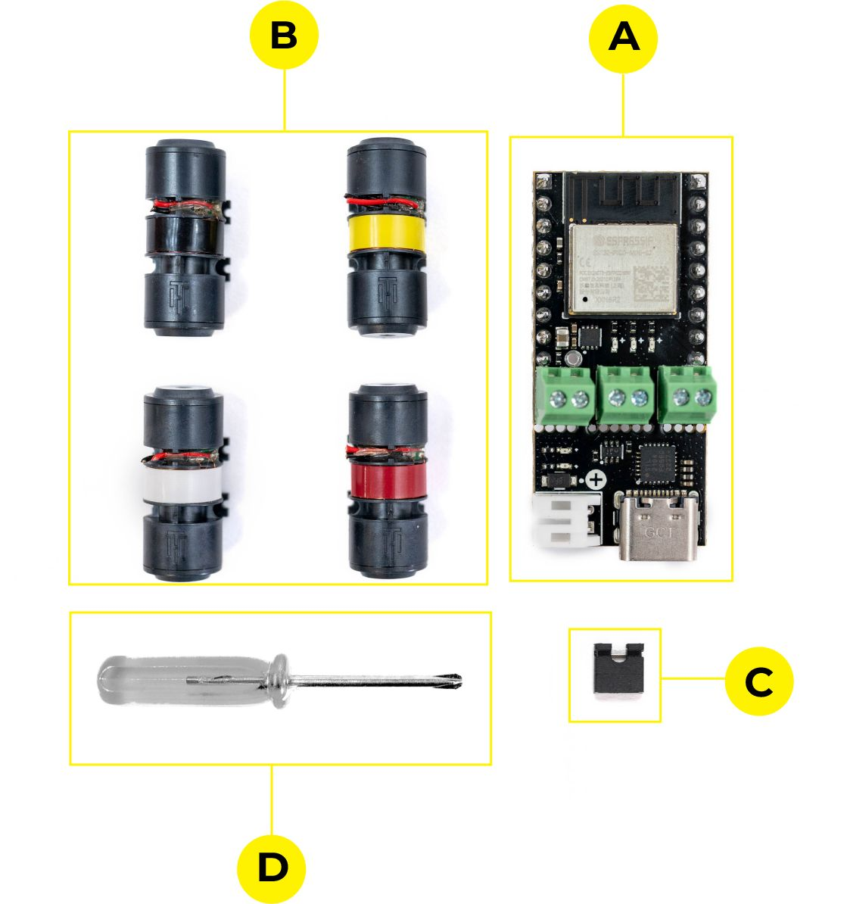

# Page 4

## Text Content

```
titanhaptics.com

Hardware Requirements
Dev Kit Included components
a.
TITAN CORE
b.
DRAKE TacHammer Motors
c.
Pin jumper
d.
Philips-head screwdriver (PH2 size)

Power Source - one or more of the following:
1.
USB-C Cable connected to a PC or power source
2.
3.3-6v Power Supply
3.
1S lipo with JST-PH2 male connector

Optional Tools
A computer with serial interface (Arduino V1.8.X Serial Terminal, PuTTY, etc.)

PRIVATE AND CONFIDENTIAL. Property of TITAN HAPTICS INC. All Rights Reserved. www.titanhaptics.com

4/ 13


```

## Images




