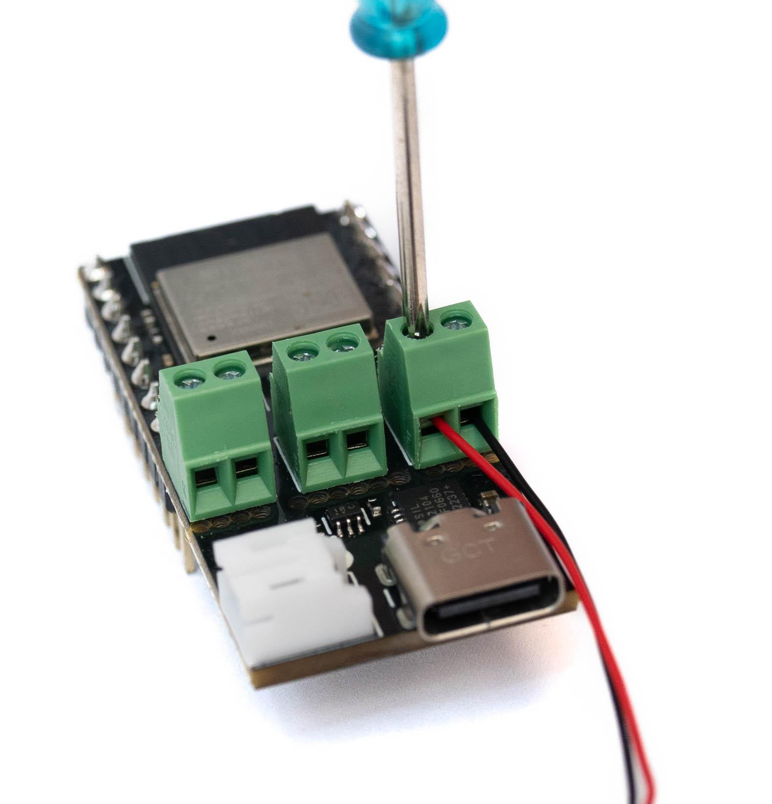
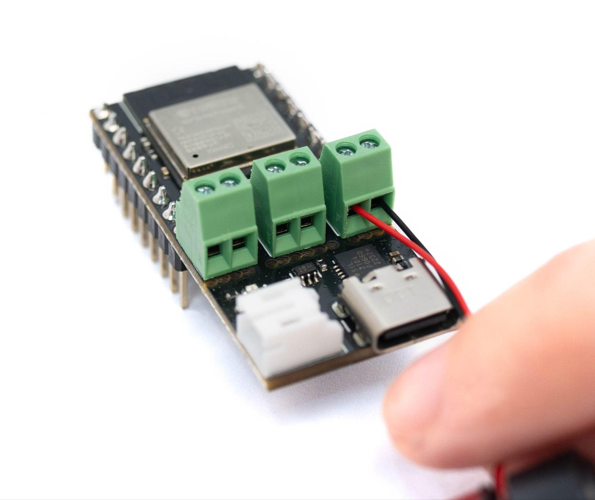
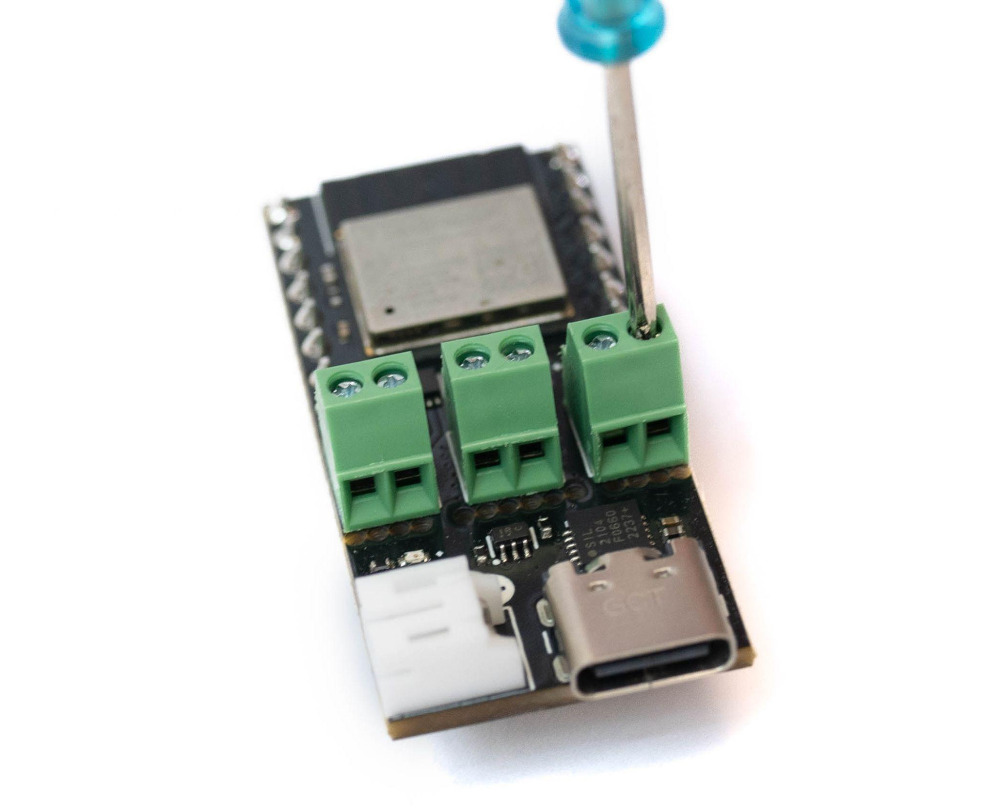

# Page 5

## Text Content

```
titanhaptics.com

Getting Started
Setup
Connect TacHammer motor(s) to TITAN CORE

1. Using the screwdriver (PH2), unscrew
(counter-clockwise)
the
terminal
connectors until the slot opens wide
enough for the motor wire to be inserted.

2. Insert motor lead wires into the
terminal connectors, red to (+) and black
to (-). (Polarities are printed on the
bottom side of the board) You can use
up to 3 motor channels (L, R, and M).

3. Once the lead wires are inserted,
tighten
(clockwise)
the
terminal
connectors using the screwdriver and
make sure the metal wires maintain
good contact with the terminal
conductive piece.

PRIVATE AND CONFIDENTIAL. Property of TITAN HAPTICS INC. All Rights Reserved. www.titanhaptics.com

5 / 13


```

## Images








