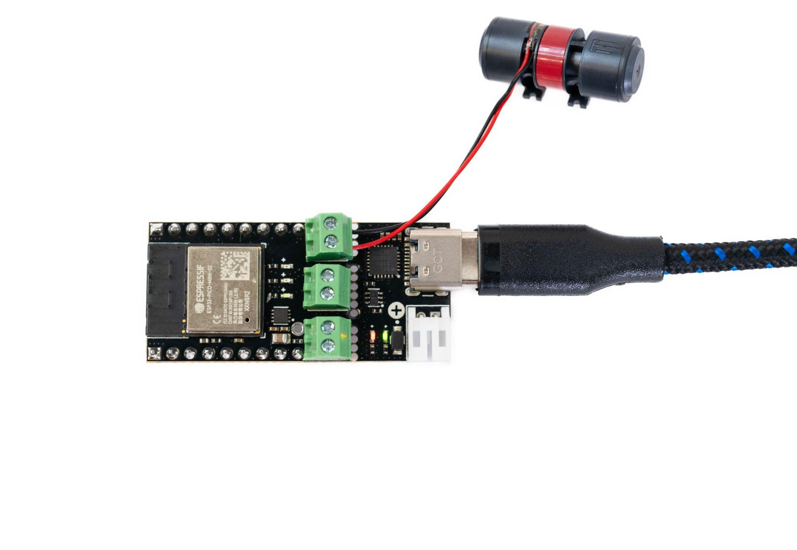
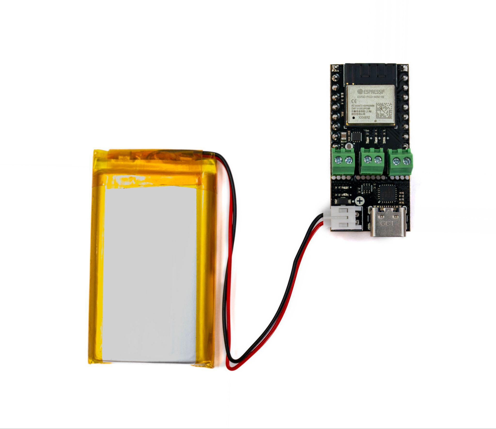
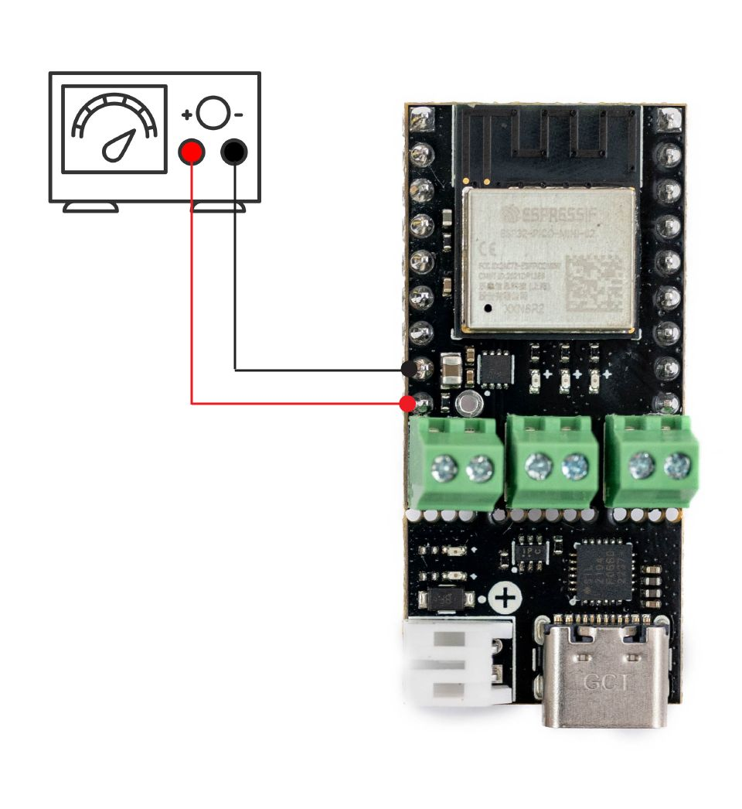

# Page 6

## Text Content

```
titanhaptics.com

Power Source
TITAN Core can be powered by one or more sources indicated below:
1.

USB

Using a USB-C cable, plug one end of
the cable to the onboard USB port, and
the other end to a USB device capable
of supplying power (laptop, computer,
tablet, powerbank). Both the main LED
and the Power module LEDs should
turn on when the board is powered via
USB.

2.

Bench Power Supply

Using a 3.3 - 6V power supply, connect
the positive terminal of the power
supply to VIN and negative terminal of
the voltage supply to GND via jumper
wires. The board LED will light up
when the board is powered.

3.
Battery
Using a 1S lipo battery with JST-PH2
male connector, plug the battery
directly into the onboard battery port
to power the board. The Main LED
should turn on when the board is
powered.
Note: The built-in automatic LiPo
battery
circuit
will
charge
a
connected battery to 4.2 Volts when a
powered USB-C source is connected.

PRIVATE AND CONFIDENTIAL. Property of TITAN HAPTICS INC. All Rights Reserved. www.titanhaptics.com

6 / 13


```

## Images








