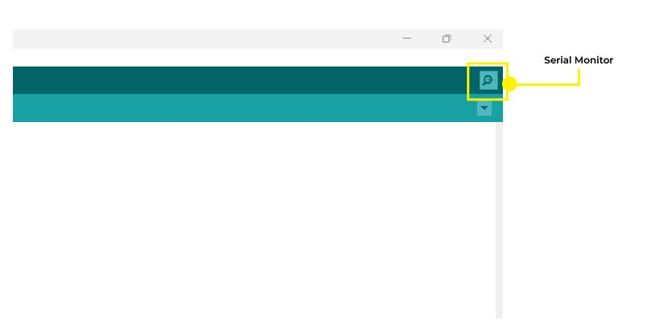

# Page 7

## Text Content

```
titanhaptics.com

Operating Modes
The TITAN CORE will boot into one of three operating modes. Use the included pin
jumper to switch between the modes. Ensure that your TITAN Core is connected to a
power supply.
1.

Serial Monitor
The serial monitor mode requires no pin jumpers to be connected. Connect the
TITAN Core via USB-C to the computer.

Go to Tools → Port and select the COM port connected to your PC.
Once you’ve installed the board, open the serial monitor and choose 115200 for the
baud rate.

Now your TITAN CORE is ready to receive serial input to actuate haptic effects. In
this mode, you may program effects for all three channels or use a specific
channel as desired.
PRIVATE AND CONFIDENTIAL. Property of TITAN HAPTICS INC. All Rights Reserved. www.titanhaptics.com

7 / 13


```

## Images




