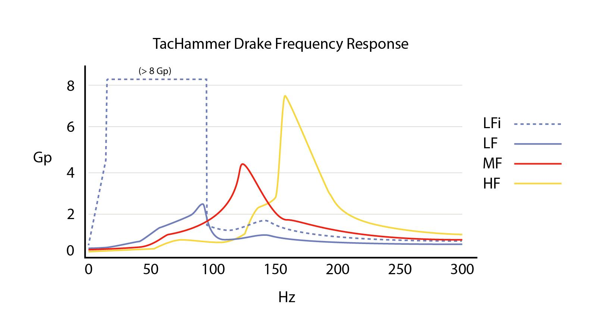

# Page 5

## Text Content

```
TACHAMMER LMR - D-10L20MP1-7

PRELIMINARY SPECIFICATIONS. SUBJECT TO CHANGE

2

Specifications

2.1

Variant Overview
LFi (Impact)

LF

MF

HF

UNIT

Peak Acceleration

19

2.5

4.5

7.5

G

Peak Acceleration Frequency
(Resonance)1

65

95

130

160

Hz

RMS Acceleration at Peak
Acceleration Frequency2

13.4

1.7

3.18

4.45

Grms

RMS Current at Peak
Acceleration Frequency2

174

170

222

145

mA

RMS Power at Peak
Acceleration Frequency2,3

242

231

394

168

mW

Acceleration Efficiency2

108

26

11.4

56

G/W

Click Energy

.95

.3

.61

.87

µAh

Latency5

~10

~10

~10

~10

ms

Rise Time

>5

>5

>5

>5

ms

5

Fall Time

>5

>5

>5

>5

ms

Noise at Peak Acceleration
Frequency6

<65

<45

<45

<45

dbA

Operating Life7

120M+

120M+

120M+

120M+

cycles

PARAMETER

4

5

2.1.1 Variant Overview - Frequency Response

TITAN HAPTICS Inc. Patented US9716423B1
TITANHAPTICS.COM

|

CONFIDENTIAL AND PROPRIETARY

5/18


```

## Images




