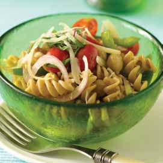

# Page 10

## Text Content

```
acknowledgments
The National Heart, Lung, and Blood Institute (NHLBI) would like
to give special thanks to those involved with the development of
Keep the Beat™ Recipes: Deliciously Healthy Dinners.
Recipes were developed by David Kamen, PCIII/C.E.C., C.C.E.,
C.H.E., Chef/Instructor at the Culinary Institute of America, and
Colleen Pierre, M.S., R.D., L.D.N., consultant and winner of a
James Beard Foundation award in nutrition journalism.
Recipe testing was conducted by Northern Illinois University
Nutrition and Dietetics Program students and faculty and
managed by Beverly Henry, Ph.D., R.D., Assistant Professor.
Photographs were taken by Ben Fink Photography.
The NHLBI nutrition staff who provided technical expertise and
direction for the cookbook include Janet De Jesus, M.S., R.D.,
Karen Donato, S.M., R.D., and Darla Danford, D.Sc., M.P.H., R.D.


```

## Images





