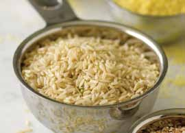

# Page 103

## Text Content

```
lentils with brown rice and kale (continued)

7

To serve, put 1 cup of the lentil mixture, in the form
of a ring, on each of four dinner plates. Fill the
center of each ring with one-fourth of the brown
rice. Serve immediately.

Tip: For starters, try the Creamy Squash Soup With Shredded Apples (on page 114).
yield:
4 servings
serving size:
1 C lentils, 1/3 C rice, ½ C kale

each serving provides:
calories
456
total fat
9g
saturated fat
1g
cholesterol
0 mg
sodium
472 mg

total fiber
protein
carbohydrates
potassium

19 g
21 g
77 g
864 mg

deliciously healthy dinners

89

vegetarian

When the lentils are tender, but not mushy, mix the
lentils, kale, and caramelized onions in the sauté pan
and stir.

main dishes

6


```

## Images



