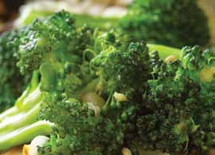

# Page 105

## Text Content

```
broccoli with asian tofu (continued)

5

Heat a grill pan or flat sauté pan over high heat.
Drain tofu, reserving marinade. Place on grill pan to
heat for about 3 minutes. Gently turn. Heat the
second side for 3 minutes.

6

At the same time, in the sauté pan over medium-low
heat, warm the peanut oil, crushed red pepper, and
garlic until the garlic softens and begins to turn
brown, about 30 seconds to 1 minute. Add broccoli
and reserved marinade, and gently mix until wellcoated.

7

Place two slices of tofu on each plate with
one-quarter of the broccoli and marinade mixture.
Sprinkle with sesame seeds (optional).

Tip: Delicious served on top of brown rice or Asian-style noodles (soba or udon).
yield:
4 servings
serving size:
2 slices tofu, with broccoli and
marinade mixture

each serving provides:
calories
183
total fat
11 g
saturated fat
2g
cholesterol
0 mg
sodium
341 mg

total fiber
protein
carbohydrates
potassium

4g
14 g
13 g
556 mg

deliciously healthy dinners

91

vegetarian

Meanwhile, heat a large nonstick sauté pan coated
with cooking spray. Add broccoli and sauté for
about 5 minutes, until it turns bright green and
becomes tender and crispy. Remove broccoli from
pan and set aside.

main dishes

4


```

## Images



