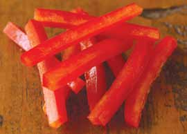

# Page 111

## Text Content

```
tofu stir-fry with spicy sauce (continued)

7

Add the carrots, red pepper, and remaining cabbage.
Cook and stir for 1 minute.

8

Add the water chestnuts and tofu. Cook and stir for
1 minute.

9

Stir the cornstarch mixture, then add to the pan.
Reduce heat to medium. Cook and stir for 1 minute,
until sauce thickens and all ingredients are well
mixed and thoroughly coated with sauce. Serve
immediately.

Tip: Delicious with steamed rice or Asian-style noodles (soba or udon).
yield:
4 servings
serving size:
2 C tofu and vegetables

each serving provides:
calories
232
total fat
10 g
saturated fat
1g
cholesterol
0 mg
sodium
289 mg

total fiber
protein
carbohydrates
potassium

8g
16 g
23 g
1,504 mg

deliciously healthy dinners

97

vegetarian

Add the last teaspoon of oil to the pan. Stir in half
the cabbage, beginning with the stalk end, the
scallions, and the garlic. Cook and stir over high
heat for 2 minutes.

main dishes

6


```

## Images



