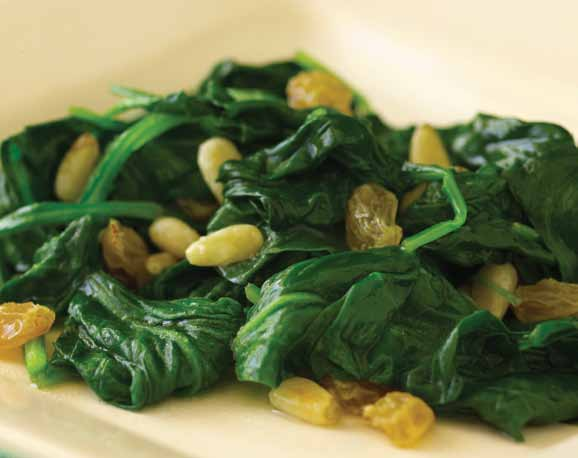

# Page 115

## Text Content

```
vegetable
side dishes

• asparagus with lemon
sauce
• cauliflower with wholewheat breadcrumbs
• grilled romaine lettuce
with caesar dressing
• baby spinach with
golden raisins and
pine nuts
• roasted beets with
orange sauce
• autumn salad
• limas and spinach
• cinnamon-glazed baby
carrots
• creamy squash soup
with shredded apples

deliciously healthy dinners

101


```

## Images




