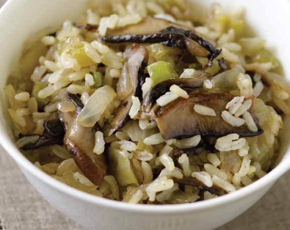

# Page 129

## Text Content

```
• couscous with carrots,
walnuts, and raisins

grain side dishes

• quinoa with paprika and
cumin
• good-for-you cornbread
• savory brown rice
• kasha with bell pepper
confetti
• parmesan rice and pasta
pilaf
• pesto baked polenta
• sunshine rice


```

## Images




