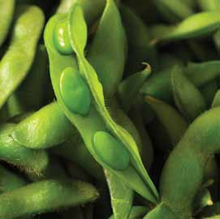
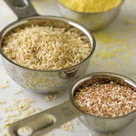
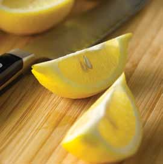

# Page 14

## Text Content

```
abbreviations
Recipes use the following abbreviations:
C................................................... cup
lb . ............................................pound
oz.............................................. ounce
pkg . ......................................package
pt..................................................pint
qt .............................................. quart
Tbsp...................................tablespoon
tsp ....................................... teaspoon
Nutrient lists use the following abbreviations:
g ................................................gram
mg ...................................... milligram


```

## Images







