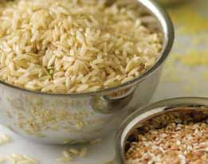
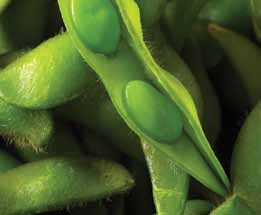

# Page 143

## Text Content

```
ingredient list (continued)
Salsa or reduced-sodium taco sauce
Spaghetti sauce, no salt added
Vinegar (apple cider, balsamic
red wine, rice)

oils and fats: low in saturated fat and
trans fat
Cooking spray
Nut oil (peanut, sesame)
Soft tub margarine
Vegetable oil (safflower, canola,
corn, olive)

nuts, seeds, and beans: low in
saturated fat and high in protein
and fiber
Low-sodium canned beans (black,
kidney, pinto, chick peas, cannellini)
Dried lentils
Unsalted nuts (almonds, pine nuts,
walnuts)

Whole-wheat pasta
Whole-wheat tortillas

frozen vegetables and legumes:
add convenience
Corn
Edamame
Vegetable stir-fry mix (no sauce added)

appendix a

whole grains: add fiber and other
nutrients to side dishes and main-dish
meals
Brown rice
Whole-wheat couscous
Quinoa
deliciously healthy dinners

129


```

## Images





