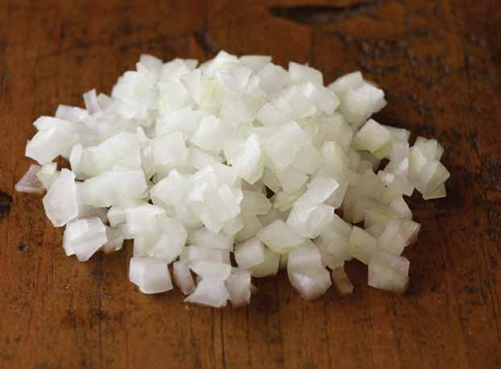

# Page 145

## Text Content

```
appendix b.

food
preparation
glossary
This appendix contains
definitions for common
cooking and food preparation techniques that are
used in Keep the Beat™
Recipes: Deliciously Healthy
Dinners.


```

## Images




