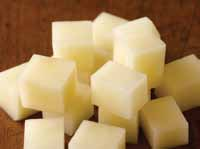
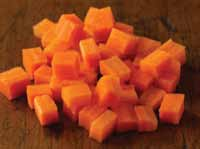
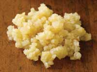
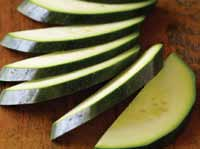
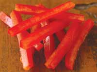

# Page 147

## Text Content

```
cutting

cube

dice

To cut food with a knife or
food processor into fine,
medium, or coarse, irregular
pieces.

To cut food into uniform
pieces, usually ½ inch on all
sides.

To cut food into smaller
uniform pieces, usually 1/8 to
¼ inch on all sides.

mince

slice

julienne

To chop food into tiny,
irregular pieces.

To cut food into flat, usually
thin slices from larger pieces.

To cut food into thin slices
about 1/8 inch thick and about
2 inches long.

deliciously healthy dinners

appendix b

chop

133


```

## Images












