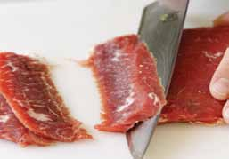

# Page 152

## Text Content

```
Calories
Calorie-free: Less than 5 calories per serving
Low-calorie: 40 calories or less per serving
Low-calorie meal: 120 calories (or less) per 3½ ounces
Reduced or less calories: At least 25 percent fewer calories per serving than
the regular version
Light (or lite): Half the fat (or less) or a third of calories per serving of the
regular version
Source: Food and Drug Administration, http://www.fda.gov/Food/GuidanceCompliance
RegulatoryInformation/GuidanceDocuments/FoodLabelingNutrition/FoodLabelingGuide/
ucm064911.htm

Question: How do I cut meat across the grain?
If you have ever wondered what it means to cut meat “against the grain,” here is
your answer.
Some cuts of meat have distinct fibers in them, which make the meat difficult to
chew. Flank steak (typically used to make London broil), skirt steak, and brisket
are good examples. Cutting through the
fibers or grain in the meat makes it
tender and easier to chew.
The picture at right shows the lines of the
steak running from right to left down the
length of the steak. If you slice this steak
in the same direction as those lines, you’ll
have to chew through the fibers. Whereas
if you cut across the lines or the grain, the
knife will have already done that work
before a bite reaches your mouth.
When slicing this type of meat, it is often recommended to slice thinly at a
45-degree angle, as shown.

138

deliciously healthy dinners


```

## Images



