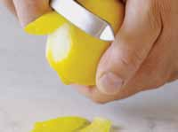
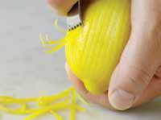
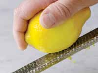

# Page 153

## Text Content

```
Question: How do I zest a lemon or orange?
Zest is the colorful outer rind on a lemon or orange (not the white pith
underneath, which is bitter). There are several ways to grate citrus peel:
•

Use a regular vegetable peeler to make thin, larger slices.  

•

Use a citrus zester, which has a stainless-steel edge with a series of
sharp-edged holes that cut off thin strips of the peel.

•

Use a microplane, or flat grater, which allows you to shred multiple small strips
of peel faster and with less pressure than a regular grater or citrus zester.

peel

zest

grate

Question: What herbs can be used to substitute for an herb I don’t

have on hand?

Although each herb has its own unique flavor, many herbs can be
substituted for one another. Here are some fresh or dried herb
alternatives to try:
For sage: Try savory, marjoram, or rosemary.

•

For basil: Try oregano or thyme.

•

For thyme: Try basil, marjoram, oregano, or savory.

•

For mint: Try basil, marjoram, or rosemary.

•

For rosemary: Try thyme, tarragon, or savory.

•

For cilantro: Try parsley or coriander.

appendix c

•

deliciously healthy dinners

139


```

## Images







