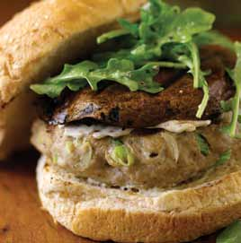

# Page 160

## Text Content

```
keep the beat™
recipes
“It has never been more important to prepare and consume homecooked meals that can support good health. . . . The Keep the Beat™
Recipes: Deliciously Healthy Dinners cookbook can help you do just
that, easily and efficiently.”
—Jane E. Brody, Personal Health columnist, The New York Times

NIH Publication No. 10-2921
October 2009
Reprinted June 2010


```

## Images




