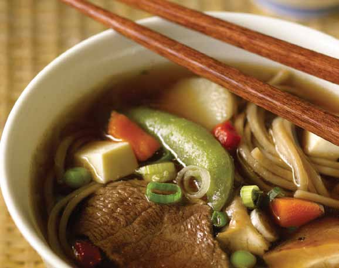

# Page 17

## Text Content

```
• cocoa-spiced beef
tenderloin with pineapple
salsa
• greek-style flank steak
with tangy yogurt sauce
• stir-fried orange beef

beef

• mediterranean kabobs
• beef steak with carrots
and mint
• broiled sirloin with spicy
mustard and apple chutney
• beef steak with light
tomato mushroom sauce
• japanese-style beef and
noodle soup
• quick beef casserole

deliciously healthy dinners

3


```

## Images




