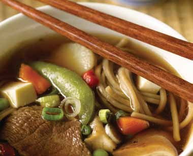

# Page 28

## Text Content

```
japanese-style beef and

Prep time:
Cook time:

noodle soup

25 minutes
15 minutes

this hearty main-meal soup is flavorful, yet simple to prepare
For broth:
4 oz
shiitake mushroom stems,
rinsed (remove caps and set
aside) (or substitute dried
shiitake mushrooms)
1 Tbsp garlic, minced (about 2–3 cloves)
1 Tbsp ginger, minced
1 stalk lemongrass, crushed (or the
zest from 1 lemon: Use a
peeler to grate a thin layer of
skin off a lemon)
1 Tbsp ground coriander
4C
low-sodium beef broth
1 Tbsp lite soy sauce
For meat and vegetables:
1 bag
(12 oz) frozen vegetable stir-fry
4 oz
shiitake mushrooms caps,
rinsed and quartered
8 oz
udon or soba noodles (or
substitute angel hair pasta),
cooked
1 lb
lean beef top sirloin, sliced
very thin
4 oz
firm silken tofu, diced
¼C
scallions (green onions), rinsed
and sliced thin

14

deliciously healthy dinners

1

Thaw frozen vegetables in the microwave (or place
entire bag in a bowl of hot water for about
10 minutes). Set aside until step 4.

2

Combine all ingredients for broth, except soy sauce,
in a medium-sized pot or saucepan.  Bring to a boil
over high heat, then lower heat and simmer for
15 minutes.

3

Strain the broth through a fine wire colander, and
discard the solid parts. Season to taste with soy
sauce.
continued on page 15


```

## Images



