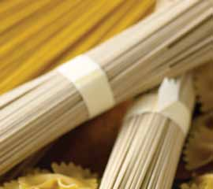

# Page 29

## Text Content

```
japanese-style beef and noodle soup (continued)

5

Add the noodles and continue to simmer for another
minute.

6

Add the beef and continue to simmer for about
5 minutes or until the beef is slightly pink
to brown (to a minimum internal temperature of
145 °F).

7

Add tofu and scallions, and simmer 1–2 minutes until
heated through.

8

Serve immediately in 1-cup portions.

beef

To finish the soup, bring the broth back to a boil.
Add the thawed vegetable stir-fry mix and mushroom
caps, and simmer for 1 minute.

Hint: There are several varieties of tofu, each with a different moisture level. Silken and soft tofu are the
moistest and easily blended into shakes, dips, and dressings. Regular tofu is less moist, and it’s best for
scrambling or using like cheese in casseroles. Firm, extra-firm, and pressed tofus are the driest. They
absorb other flavors easily and hold their shape in stir-fries and on the grill.
yield:
4 servings
serving size:
1 C soup

each serving provides:
calories
325
total fat
8g
saturated fat
3g
cholesterol
52 mg
sodium
285 mg

total fiber
protein
carbohydrates
potassium

4g
36 g
28 g
882 mg

deliciously healthy dinners

main dishes

4

15


```

## Images



