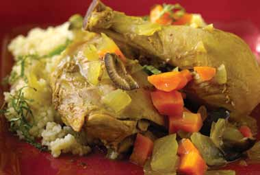

# Page 32

## Text Content

```
moroccan chicken stew with
couscous

Prep time:
Cook time:

15 minutes
30 minutes

spice it up with this traditional dish from northern Africa
1 Tbsp
1 lb
1 Tbsp
1C
1C
¼C
2C
½C
¼ tsp
1 Tbsp

olive oil
skinless chicken legs, split
(about 4 whole legs)
Moroccan spice blend*
carrots, rinsed, peeled, and
diced
onion, diced
lemon juice
low-sodium chicken broth
ripe black olives, sliced
salt
chili sauce (optional)

For couscous:
1C
low-sodium chicken broth
1C
couscous (try whole-wheat
couscous)
1 Tbsp fresh mint, rinsed, dried, and
shredded thin (or 1 tsp dried)

18

deliciously healthy dinners

1

Heat olive oil in a large sauté pan. Add chicken legs,
and brown on all sides, about 2–3 minutes per side.
Remove chicken from pan and put on a plate with a
cover to hold warm.

2

Add spice blend to sauté pan and toast gently.

3

Add carrots and onion to sauté pan, and cook for
about 3–4 minutes or until the onions have turned
clear, but not brown.

4

Add lemon juice, chicken broth, and olives to sauté
pan, and bring to a boil over high heat. Add chicken
legs, and return to a boil. Cover and gently simmer
for about 10–15 minutes (to a minimum internal
temperature of 165 °F).
continued on page 19


```

## Images



