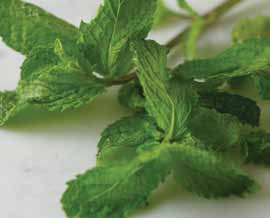

# Page 33

## Text Content

```
moroccan chicken stew with couscous (continued)

6

Fluff couscous with a fork, and gently mix in the
mint.

7

When chicken is cooked, add salt. Serve two chicken
legs over ½ cup couscous topped with ½ cup sauce
in a serving bowl. Add chili sauce to taste.

Tip: Try serving with a side of Cinnamon-Glazed Baby Carrots (on page 113).
* You also can make your own Moroccan spice blend by mixing 1 teaspoon each of ground coriander, ground
cumin, ground ginger, and ground cinnamon per 1 pound of meat or chicken. Make this mix in advance and
store it in your pantry to use as needed.
yield:
4 servings
serving size:
2 chicken legs, ½ C couscous,
½ C sauce

each serving provides:
calories
333
total fat
12 g
saturated fat
2g
cholesterol
51 mg
sodium
415 mg

total fiber
protein
carbohydrates
potassium

6g
24 g
36 g
478 mg

deliciously healthy dinners

19

poultry

Meanwhile, prepare the couscous by bringing
chicken broth to a boil in a saucepan. Add couscous,
and remove from the heat. Cover and let stand for
10 minutes.

main dishes

5


```

## Images



