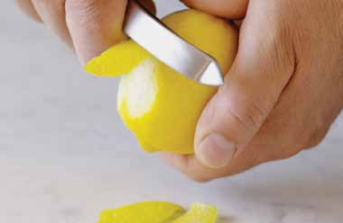

# Page 34

## Text Content

```
thai-style chicken curry

Prep time:
Cook time:

20 minutes
25 minutes

classic Thai flavors blend together beautifully in this delicious curry; add more green curry
paste for a spicy kick
For sauce:
1 Tbsp peanut oil or vegetable oil
1 Tbsp ginger, minced (or a 1-inch
piece, crushed)
½ Tbsp garlic, minced (about 1 clove)
¼C
scallions (green onions), rinsed
and chopped
1 Tbsp lemongrass, minced (or the zest
from 1 lemon: Use a peeler to
grate a thin layer of skin off a
lemon)
1 Tbsp Thai green curry paste
½C
light coconut milk (or use a
spoon to discard visible layer of
fat off the top of an unshaken
can of regular coconut milk;
then, measure ½ C for recipe)
1 tsp
honey
1 tsp
lite soy sauce
1 tsp
fish sauce
1 Tbsp cornstarch
½C
low-sodium chicken broth
For chicken and vegetables:
1 bag
(12 oz) frozen vegetable stir-fry
12 oz
boneless, skinless chicken
breast, cut into thin strips

20

deliciously healthy dinners

1

Thaw frozen vegetables in the microwave (or
place entire bag in a bowl of hot water for about
10 minutes). Set aside until step 7.

2

For sauce, heat oil in a small saucepan on medium
heat. Add ginger, garlic, scallions, and lemongrass,
and cook gently until tender, but not brown,
about 2–3 minutes.

3

Add curry paste, and cook for an additional
2–3 minutes.

4

Add coconut milk, honey, soy sauce, and fish sauce,
and bring to a boil over high heat.

5

In a bowl, mix cornstarch with chicken broth. Add
mixture to the saucepan, and return to a boil while
stirring constantly.
continued on page 21


```

## Images



