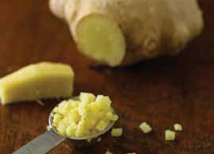

# Page 35

## Text Content

```
thai-style chicken curry (continued)

7

Add thawed vegetables, and continue to cook
gently with lid on until the vegetables are heated
through, an additional 2–3 minutes.

8

Divide into four even portions, each about 3 ounces
chicken breast and 1 cup vegetables, and serve.

Tip: Delicious served over rice or Asian-style noodles (soba or udon).
yield:
4 servings
serving size:
3 oz chicken, 1 C vegetables

each serving provides:
calories
207
total fat
7g
saturated fat
3g
cholesterol
50 mg
sodium
249 mg

total fiber
protein
carbohydrates
potassium

3g
23 g
14 g
406 mg

deliciously healthy dinners

21

poultry

Lower heat to a simmer, and add chicken strips.
Simmer gently for 5–8 minutes.

main dishes

6


```

## Images



