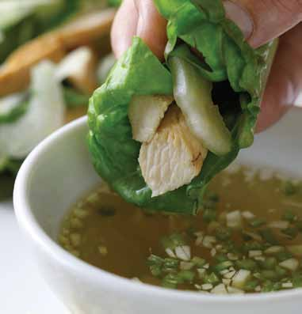

# Page 44

## Text Content

```
asian-style chicken wraps

Prep time:
Cook time:

15 minutes
20 minutes

delicious on their own, or try serving with a side of Sunshine Rice (on page 126)
For sauce:
1
small Jalapeno chili pepper,
rinsed and split lengthwise—
remove seeds and white
membrane, and mince (about
1 Tbsp); for less spice, use
green bell pepper
1 Tbsp garlic, minced (about 2–3 cloves)
3 Tbsp brown sugar or honey
½C
water
½ Tbsp fish sauce
2 Tbsp lime juice (or about 4 limes)
For chicken:
1 Tbsp peanut oil or vegetable oil
1 Tbsp ginger, minced
1 Tbsp garlic, minced (about 2–3 cloves)
12 oz
boneless, skinless chicken breast,
cut into thin strips
1 Tbsp lite soy sauce
1 Tbsp sesame oil (optional)
1 Tbsp sesame seeds (optional)
For wrap:
1
(small) head red leaf lettuce,
rinsed, dried, and separated into
single leaves large enough to
create wrap
8
fresh basil leaves, whole, rinsed
and dried
2C
bok choy or Asian cabbage,
rinsed and shredded
30

deliciously healthy dinners

1

To prepare the sauce, add all ingredients to a
saucepan, and bring to a boil over high heat.
Remove from heat, and let sit in hot saucepan
for 3–5 minutes. Chill in refrigerator for about
15 minutes or until cold.

2

Prepare the chicken by heating oil in a large wok or
sauté pan. Add ginger and garlic, and stir fry briefly
until cooked but not brown, about 30 seconds to
1 minute.
continued on page 31


```

## Images



