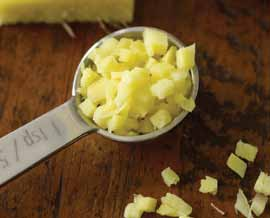

# Page 45

## Text Content

```
asian-style chicken wraps (continued)

4

Add soy sauce, sesame oil (optional), and sesame
seeds (optional), and return to a boil. Remove from
the heat, and cover with lid to hold warm in hot
sauté pan.

5

Assemble each wrap: Place one large red lettuce leaf
on a plate, then add ½ cup chicken stir-fry, 1 basil
leaf, and ¼ cup shredded cabbage and fold together.
Serve two wraps with ¼ cup sauce.

each serving provides:
calories
242
total fat
10 g
saturated fat
2g
cholesterol
47 mg
sodium
393 mg

total fiber
protein
carbohydrates
potassium

3g
21 g
17 g
636 mg

deliciously healthy dinners

31

poultry

Add chicken, and continue to stir fry for 5–8 minutes.

main dishes

yield:
4 servings
serving size:
2 wraps, ¼ C sauce

3


```

## Images



