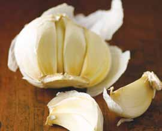

# Page 51

## Text Content

```
turkey mole (continued)
Broil turkey in preheated oven or grill for 3–5 minutes
on each side or until the turkey is fully cooked (to a
minimum internal temperature of 165 °F).

9

Serve one piece of turkey with ½ cup of the warm
mole sauce.

main dishes

8

poultry

Tip: Try serving with rice and Baby Spinach With Golden Raisins and Pine Nuts (on page 107).
yield:
4 servings
serving size:
1 turkey fillet, ½ C sauce

each serving provides:
calories
217
total fat
9g
saturated fat
1g
cholesterol
53 mg
sodium
421 mg

total fiber
protein
carbohydrates
potassium

2g
24 g
9g
419 mg

deliciously healthy dinners

37


```

## Images



