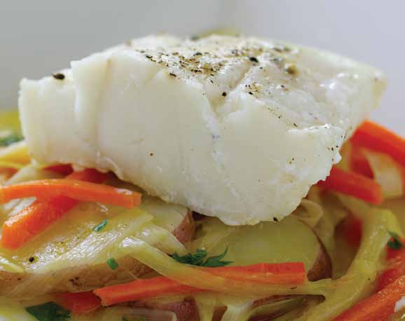

# Page 53

## Text Content

```
• grilled tuna with chickpea
and spinach salad
• baja-style salmon tacos
• spanish-style shrimp stew
• braised cod with leeks

seafood

• baked red snapper with
zesty tomato sauce
• teriyaki-glazed salmon with
stir-fried vegetables
• red snapper provencal
• asian-style steamed salmon
• baked salmon dijon
• fish veronique


```

## Images




