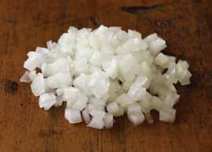

# Page 89

## Text Content

```
turkey bolognese with shell pasta (continued)

8

Drain pasta. Add pasta to turkey mixture (the
minimum internal temperature of cooked turkey
should be 165 °F). Stir to blend well.

9

Divide pasta mixture evenly (about 2 cups each)
among four dinner plates. Top each with
2 tablespoons of shredded parmesan cheese.

pastas

Optional step: While the pasta and turkey mixture
cooks, strain mushrooms, draining unabsorbed wine
directly into the turkey mixture. Place mushrooms on
a cutting board and chop finely, or place in food
processor and pulse once or twice to more finely
chop mushrooms. Stir mushrooms into turkey
mixture. Simmer for 10–15 minutes to blend flavors.

Tip: Serve with a side of sliced fresh tomatoes, cucumbers, and balsamic vinegar.
yield:
4 servings
serving size:
about 2 C pasta

each serving provides:
calories
463
total fat
9g
saturated fat
3g
cholesterol
63 mg
sodium
465 mg

total fiber
protein
carbohydrates
potassium

5g
35 g
47 g
734 mg

deliciously healthy dinners

main dishes

7

75


```

## Images



