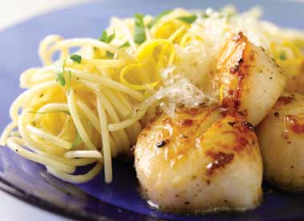

# Page 90

## Text Content

```
lemon and garlic pasta with

Prep time:
Cook time:

10 minutes
10 minutes

pan-seared scallops

for a delicious and quick meal, this pasta and scallops dish will hit the spot
1

1 Tbsp
2 Tbsp
16
¼ tsp
1
/8 tsp
8 oz
2 Tbsp

76

large lemon, grated for zest
(and freshly squeezed for
2 Tbsp lemon juice)
garlic, minced or pressed
(about 2–3 cloves)
olive oil, divided into two
1-Tbsp portions
large sea scallops (about 1 lb)
salt
ground black pepper
very thin spaghetti (vermicelli
or angel hair)
shredded parmesan cheese

deliciously healthy dinners

1

In a 4-quart saucepan, bring 3 quarts of water to a
boil over high heat. When the water boils, reduce
heat to simmer until you’re ready to cook the pasta
(step 5).

2

While the water is heating up, use a grater to take
off small peels of the skin of the lemon into a small
saucepan.  Cut the lemon in half and squeeze the
juice into the pan and remove pits. Use the back of a
large spoon to press the inside of the lemon to
extract more juice. Add the garlic and 1 tablespoon
of the olive oil to the saucepan. Stir to blend well.
Place on stovetop on low heat.
continued on page 77


```

## Images



