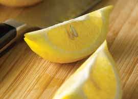

# Page 91

## Text Content

```
lemon and garlic pasta with pan-seared scallops (continued)

4

Place the scallops in the hot pan. Cook about
4 minutes on each side, or until scallops are well
browned and firm and milky white to the center
(to a minimum internal temperature of 145 °F).

5

After turning the scallops to the second side, drop
the pasta into the boiling water. Set temperature on
medium, and cook for 2 minutes or the shortest
recommended time according to package directions.

6

When the pasta is done, set aside ½ cup of the
cooking water. Drain the pasta. Return drained
pasta to the pot, and toss with the warm olive oil
mixture and the ½ cup reserved pasta water.

7

Divide the pasta equally among four plates (about
1 cup per plate). Top each with four scallops.

8

Garnish each dish with ½ tablespoon of shredded
parmesan cheese. Serve immediately.

Tip: Delicious with a side of Baby Spinach With Golden Raisins and Pine Nuts (on page 107).
yield:
4 servings
serving size:
4 scallops, 1 C pasta

each serving provides:
calories
376
total fat
9g
saturated fat
2g
cholesterol
48 mg
sodium
429 mg

total fiber
protein
carbohydrates
potassium

2g
28 g
43 g
426 mg

deliciously healthy dinners

77

pastas

Heat a large nonstick pan or grill pan on high
temperature until very hot. Sprinkle the scallops with
salt, pepper, and 1 tablespoon of olive oil. Toss to
coat well.

main dishes

3


```

## Images



