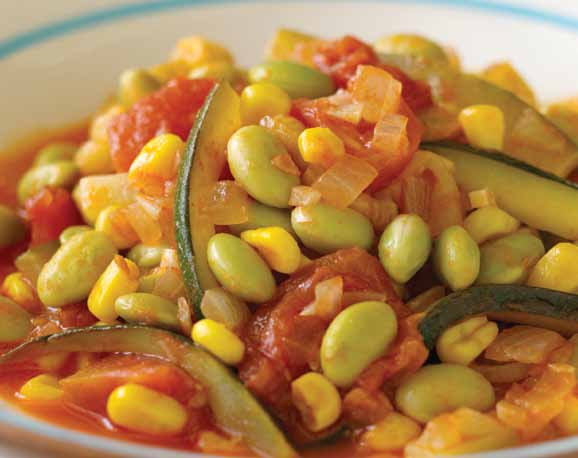

# Page 95

## Text Content

```
vegetarian
main-dish meals

• tuscan beans with
tomatoes and oregano
• caribbean casserole
• red beans and rice
• corn and black bean
burritos
• lentils with brown rice
and kale
• broccoli with asian tofu
• three-bean chili with
chunky tomatoes
• caribbean pink beans
• edamame stew
• tofu stir-fry with
spicy sauce


```

## Images




