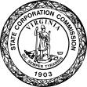

# Page 2

## Text Content

```
Form

LLC1050
(Rev. 09/21)
State Corporation
Commission

Articles of Cancellation of a Virginia
Limited Liability Company

Pursuant to § 13.1-1050 of the Code of Virginia, the undersigned, on behalf of the limited liability company named below,
states as follows:
Article I

The limited liability company’s name:
____________________________________________________________________________________

Article II

The LLC’s SCC ID Number: _____________________________________________________________

Article III

The LLC’s certificate of organization issued by the Commission was effective on: ___________________

Article IV

The LLC has completed the winding up of its affairs.

Article V

Other information the members determine to include (optional):
____________________________________________________________________________________
____________________________________________________________________________________
Signature

The official signing this document has been delegated the right and power to manage the company’s business affairs and
affirms the above statements are true.

Signature

Date

Tel. # (optional)

Printed Name

Title

Email Address (optional)

Business Tel. # (optional)

Business Email Address (optional)

Provide a name and mailing address for sending correspondence regarding the filing of this document (if
left blank, correspondence will be sent to the registered agent at the registered office):

Name

Address

Required Fee: $25.00


```

## Images



